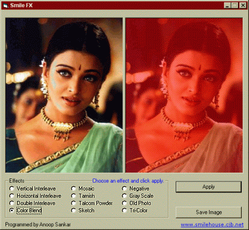



## SmileFX Graphics Effects Demo without using API or OCX

### Description

A graphics demo app that does not use OCX or API.

The various effects included are Interleave, Mosaic, Tarnish, Talcom Powder, Sketch etc. etc.

The code is well commented and logic of each effect is explained. I have not used API so that even beginners can understand the pixel by pixel logic involved.

Vote if you like it :-) and more importantly post your feedback.
 
### More Info
 

             |
---                |---
**Submitted On**   |2002-05-05 08:18:44
**By**             |[Anoop Sankar](https://github.com/Planet-Source-Code/PSCIndex/blob/master/ByAuthor/anoop-sankar.md)
**Level**          |Beginner
**User Rating**    |5.0 (40 globes from 8 users)
**Compatibility**  |VB 5\.0, VB 6\.0
**Category**       |[Graphics](https://github.com/Planet-Source-Code/PSCIndex/blob/master/ByCategory/graphics__1-46.md)
**World**          |[Visual Basic](https://github.com/Planet-Source-Code/PSCIndex/blob/master/ByWorld/visual-basic.md)
**Archive File**   |[SmileFX\_Gr1412601052002\.zip](https://github.com/Planet-Source-Code/anoop-sankar-smilefx-graphics-effects-demo-without-using-api-or-ocx__1-39572/archive/master.zip)

